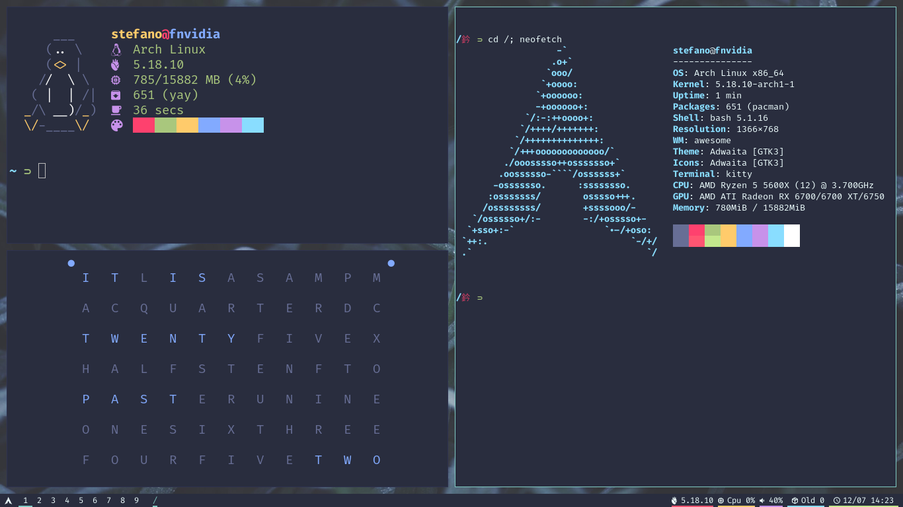
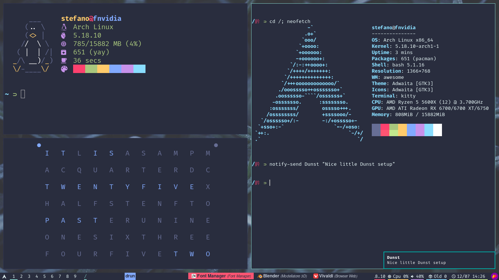
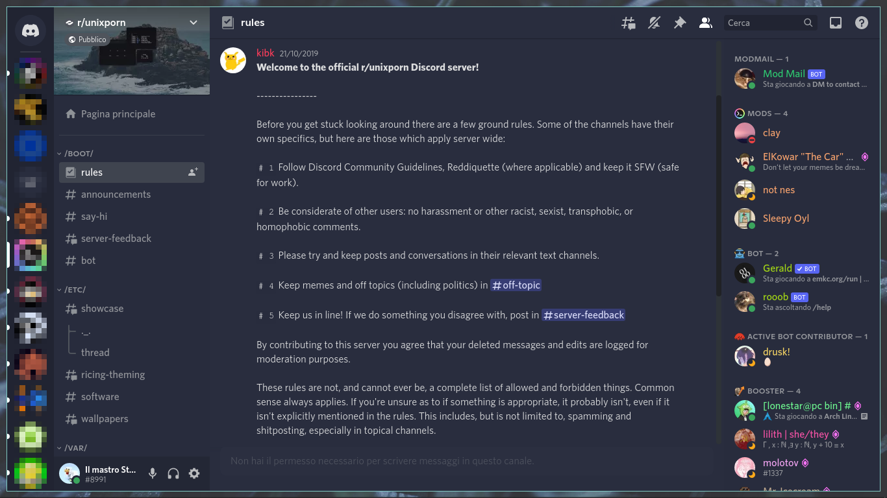
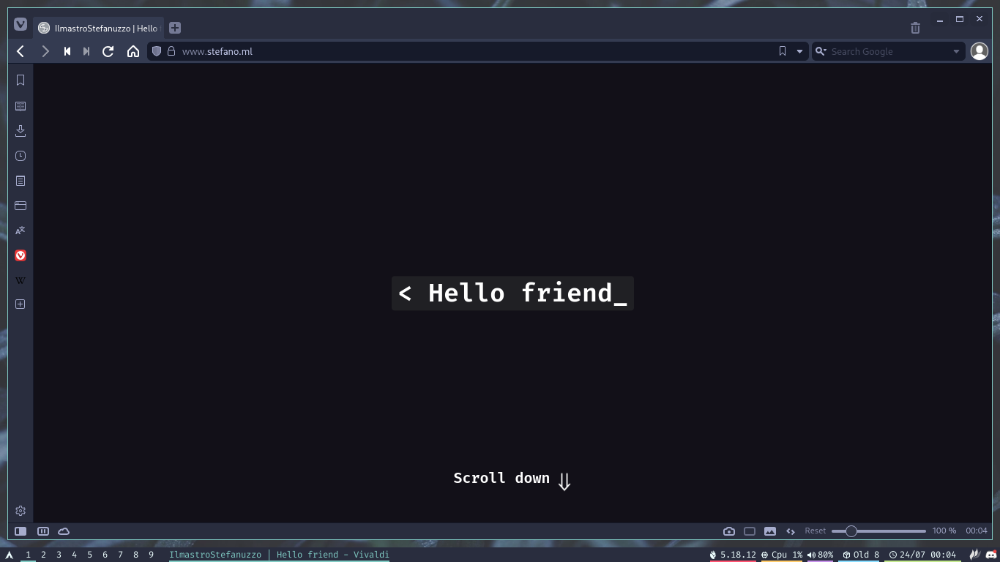
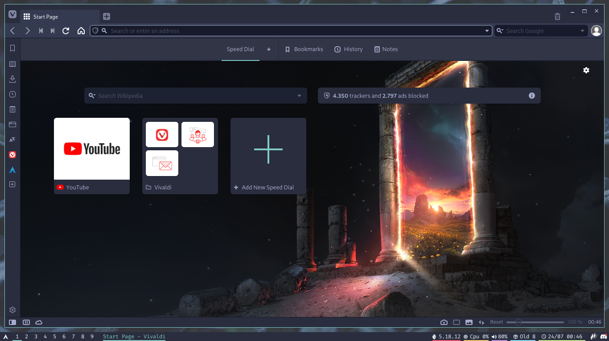
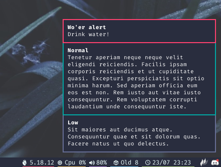

# My dotfiles

<p align="middle"></p>
<p align="middle">
    
    &nbsp;
    
    <a href="https://stefano.ml"></a>
    &nbsp;
    
</p>
<p align="middle">
    
</p>

## Features

Distinctive features:

-   Hide/Show status bar with Super + Space

Generic features:

-   Palenight theme
    -   Custom Discord CSS
-   [Vivaldi themes](vivaldi-themes)
    -   In the first screenshot [my website](https://stefano.ml) is shown!
-   Handy aliases

## Programs

Main programs used:

-   [AwesomeWM](https://awesomewm.org) (Window Manager)
-   [Polybar](https://github.com/polybar/polybar#readme) (Status bar)
-   [Rofi](https://github.com/davatorium/rofi#--rofi) (App launcher)
-   [Kitty](https://sw.kovidgoyal.net/kitty) (Terminal emulator)
-   [Starship](https://starship.rs) (Custom shell prompt)

Minor programs:

-   [Dunst](https://github.com/dunst-project/dunst#readme) (Notification daemon)
-   [Feh](https://github.com/derf/feh#readme) (Wallpaper setter)
-   [Ly](https://github.com/fairyglade/ly#readme) (TUI Display manager)
    -   There are no config files for it here, but [check this out](https://github.com/IlmastroStefanuzzo/tty-ly-colors).
-   [Discocss](https://github.com/mlvzk/discocss#readme) (Inject custom CSS into Discord)
-   [LSD](https://github.com/Peltoche/lsd#readme) (Prettier ls)
-   [Nerdfetch](https://github.com/ThatOneCalculator/NerdFetch#readme) (Fetch program)

GTK, Qt, Icons

-   [LXAppearance](https://github.com/lxde/lxappearance) (Set GTK theme)
-   [Qt5ct](https://qt5ct.sourceforge.io) (Set Qt theme)
-   [qt5-styleplugins](https://github.com/qt/qtstyleplugins) (Uniform look between GTK and Qt)
-   Palenight theme from the [GTK Theme Framework](https://github.com/jaxwilko/gtk-theme-framework#gtk-theme-framework)
    -   [palenight-gtk-theme](https://aur.archlinux.org/packages/palenight-gtk-theme) in the AUR
-   [Papirus](https://github.com/PapirusDevelopmentTeam/papirus-icon-theme#readme) icons

Make sure you install [Fira Code Nerd Fonts](https://github.com/ryanoasis/nerd-fonts/tree/master/patched-fonts/FiraCode#readme). On Arch you can use the AUR: `yay -S nerd-fonts-fira-code`.

## Wallpapers

To choose a wallpaper, edit `.config/awesome/theme.lua` setting the path for your image in the `theme.wallpaper` variable.  
Alternatively, edit `.scripts/.fehbg` to choose the path, then tell Awesome to execute that script by uncommenting the related line (just search for "feh" in the `.config/awesome/rc.lua` file).

## Installation

> If you want to straight up copy all the dotfiles (**<u>never recommended</u>**).

-   Make sure you installed all the programs listed above as well as `git` (but you do already have it, right?).
-   Install [GNU Stow](https://www.gnu.org/software/stow/manual/stow.html) with your package manager (e.g.: `pacman -S stow`).
-   Clone the repo into `~/.dotfiles`.
    ```sh
    git clone https://git.stefano.ml/dotfiles ~/.dotfiles
    ```
-   Or update if you've already cloned it.
    ```sh
    cd ~/.dotfiles && git pull
    ```
-   Stow will automagically symlink all the files in the correct directories.
    ```sh
    cd ~/.dotfiles  # Important or you'll make a mess
    stow .
    ```
    -   To better understand what's happening, [check this video out](https://youtu.be/CxAT1u8G7is).
-   If you get any errors saying files already exist, remove them or, even better, rename them to have a backup.
    ```sh
    mv ~/.bashrc ~/.bashrc.bak
    ```
-   Done!

## Note

All the configuration files which are in use and have DistroTube's logo in them are modified versions of the originals, but are not copies.  
Give a look at [DT's dotfiles](https://gitlab.com/dwt1/dotfiles).
